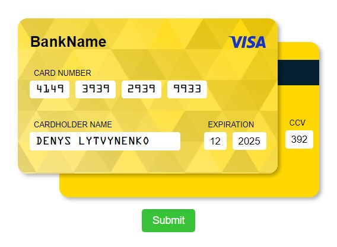
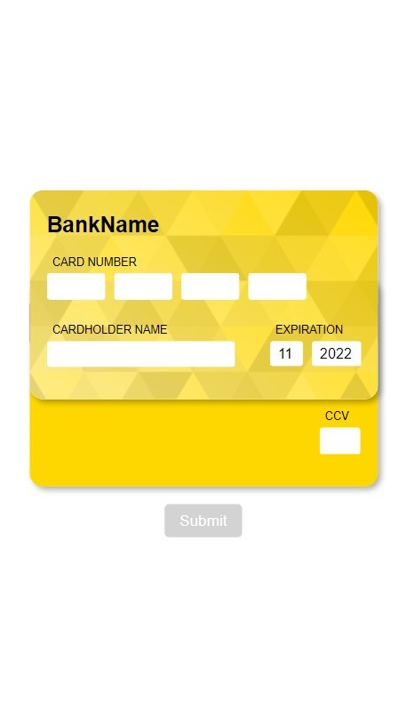
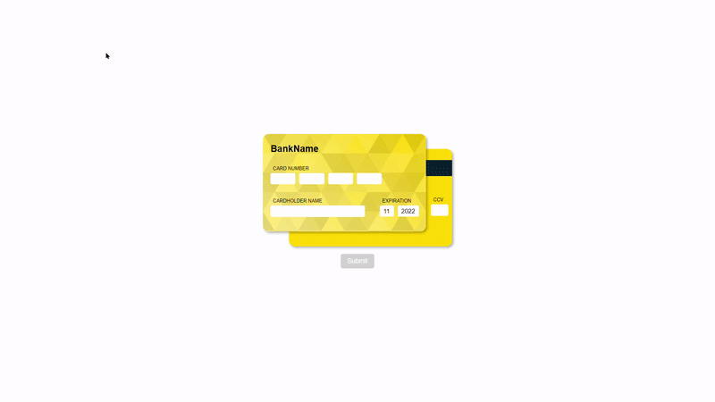
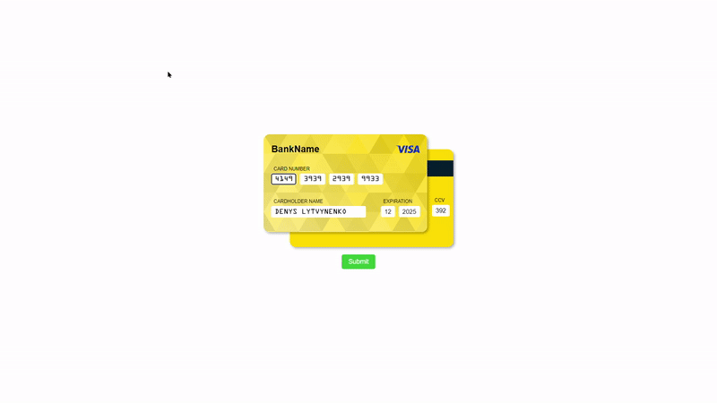

# Project info


Reusable card component with auto payment system detection and ability of customization card view.

# Desktop layout



# Mobile layout



# Auto detection of payment system

Implemented auto detection of payment system by using https://lookup.binlist.net/ API. <br>
On typing of first 4-6 digits of card number API call occurs to detect payment system. After receiving of successful response from the API you can see payment system logo at the top right corner of the front card.


# Form validation


# Ability to control form by the arrow keys



# Supported payment systems

-   4149 - Visa
-   5168 - Mastercard
-   6222 - Unionpay
-   3782 - AMEX
-   60110 - Discover

# Run project

1. First of all you need to install dependencies from npm:

```
npm install
```

2. Run project via command:

```
npm start
```

# License

Copyright (c) 2023 Denys Lytvynenko. All rights reserved.

Licensed under the [MIT](./LICENSE.txt) license.
